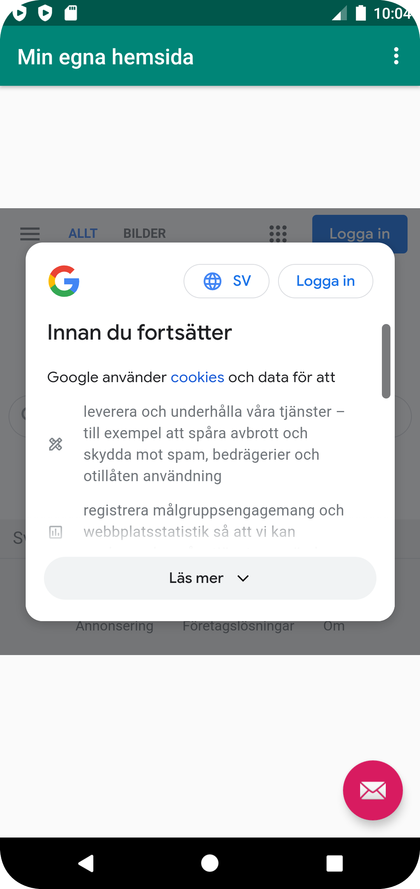
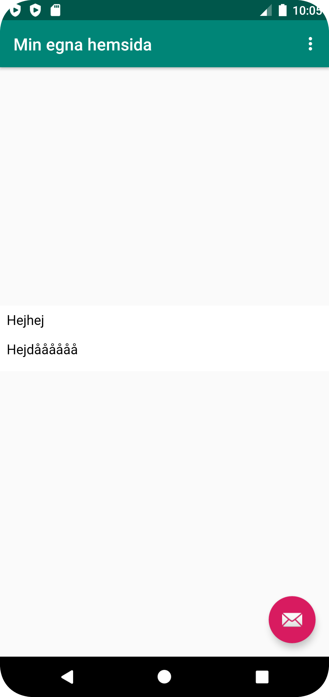

# Rapport


I denna uppgiften skapade jag en WebView i "content_main.xml". Sedan instansierade jag en WebView i "MainActivity.java" med id som jag satte på
WebViewn i xml-filen. Sedan enablade jag internet access och javascript. Jag implementerade sedan metoderna "showInternalWebPage" och "showExternalWebPage"
att ladda urlerna för en lokal htmlfil och en extern hemsida via metoden "loadUrl()". Koden för detta ser ut som nedan:


MainActivity.java:
```
    private WebView myWebView;


    public void showExternalWebPage(){
       myWebView.loadUrl("https://www.test.se");
    }

    public void showInternalWebPage(){
        myWebView.loadUrl("file:///android_asset/index.html");
    }


     myWebView = findViewById(R.id.my_webview);
     WebViewClient webViewClient = new WebViewClient();
     myWebView.setWebViewClient(webViewClient);

     WebSettings webSettings = myWebView.getSettings();
     webSettings.setJavaScriptEnabled(true);


      if (id == R.id.action_external_web) {
          showExternalWebPage();
          Log.d("==>","Will display external web page");
          return true;
      }

      if (id == R.id.action_internal_web) {
         showInternalWebPage();
          Log.d("==>","Will display internal web page");
          return true;
      }
```

AndroidManifest:
`<uses-permission android:name="android.permission.INTERNET" />`

content_main.xml:
` <WebView android:id="@+id/my_webview" />`

strings.xml:
`<string name="app_name">Min app</string>`



